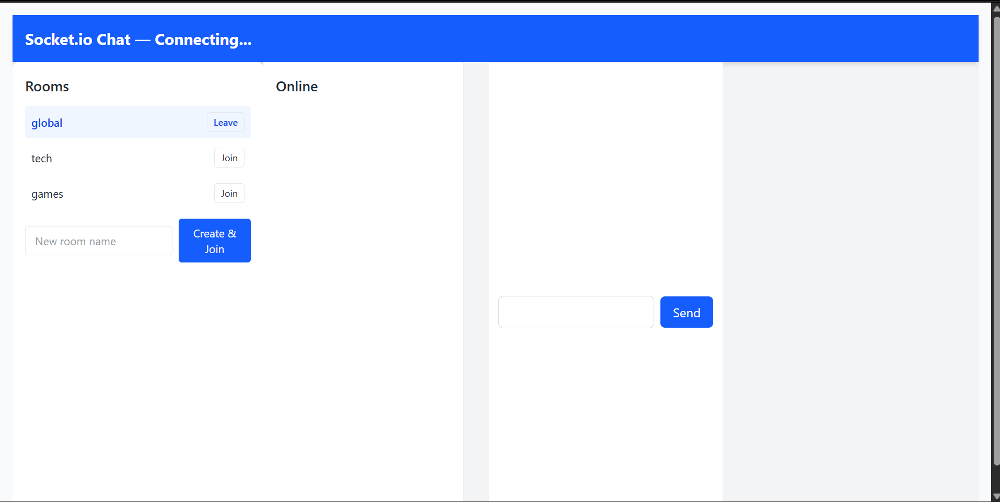

# Real-time Chat with Socket.IO & MongoDB

Simple real-time chat app (React client + Node.js server) using Socket.IO and MongoDB.  
This repo contains a client (React) and server (Express + Socket.IO + Mongoose).

## Contents
- client/ — React front-end (hooks useSocket.js)
- server/ — Node.js back-end (Express, Socket.IO, Mongoose)
  - models/ — Mongoose models (Message, Room, User)
  - routes/ — REST endpoints for messages, rooms, users
  - middleware/ — auth middleware (JWT)
  - utils/ — socket init helper (optional)

## Requirements
- Node.js (v18+ recommended)
- npm
- MongoDB running locally or remote

## Environment
Create `.env` files with these variables.

Server (`server/.env`):
```
PORT=5000
MONGODB_URI=mongodb://localhost:27017/chat-app
CLIENT_URL=http://localhost:3000
JWT_SECRET=your_secure_jwt_secret_here
NODE_ENV=development
```

Client (`client/.env`) — create if missing:
```
REACT_APP_SOCKET_URL=http://localhost:5000
```
> After editing client .env, restart the React dev server.

## Install & Run

Open two terminals.

1. Server
```powershell
cd c:\Users\Hp\Desktop\real-time-communication-with-socket-io-Ezrasanga\server
npm install
npm run dev     # uses nodemon; or `npm start`
```

2. Client
```powershell
cd c:\Users\Hp\Desktop\real-time-communication-with-socket-io-Ezrasanga\client
npm install
npm start
```

Verify server health:
```powershell
curl http://localhost:5000/health
# {"status":"ok"}
```

## Key API Endpoints (server)
- GET /api/messages?room=roomName&limit=100 — fetch messages
- POST /api/messages — create message (body: content, from, room, private)
- GET /api/rooms — list public rooms
- POST /api/rooms — create room (protected)
- POST /api/users/register — register user
- POST /api/users/login — login user

## Socket.IO events (frontend ↔ backend)
Client emits:
- `join` { username } — register user socket
- `message` { content, from, room? } — broadcast message
- `privateMessage` { toSocketId, payload } — send private msg
- `typing` { room, from, typing } — typing indicator
- `joinRoom` { room } / `leaveRoom` { room }

Server emits:
- `message` — broadcasted persisted message
- `privateMessage`
- `onlineUsers` — array of online usernames
- `typing` — typing notifications

Ensure client socket uses `REACT_APP_SOCKET_URL` or correct host/port  
(useSocket.js logs the chosen URL to browser console).

## Database models (summary)
- Message: content, from, to, room, private, timestamp
- Room: name, description, createdBy, members, isPrivate, createdAt
- User: username, password (hashed)

## Common issues & fixes
- WebSocket connection refused / wrong port:
  - Confirm server port (default 5000) and client REACT_APP_SOCKET_URL match.
  - Search client for hard-coded ports (e.g., 4000) and update.
- MODULE_NOT_FOUND for `jsonwebtoken`, `bcrypt`:
  - Run `npm install` in server folder (install missing packages).
- After changing client `.env`, restart React dev server.
- If connections fail: check server logs, browser console, firewall/AV blocking ports.

## Development notes
- Socket logic is in server/utils/socket.js or directly in server.js depending on setup.
- Persist messages to MongoDB in the message handler to keep history consistent.

## Testing
- Use REST endpoints (curl / Postman) and open multiple browser windows to test real-time updates.
- Check `curl http://localhost:5000/api/messages` to view stored messages.

## License
MIT
## Preview
